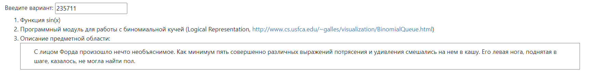

### **Лабораторная работа #1**

1. Для указанной функции провести модульное тестирование разложения функции в степенной ряд. Выбрать достаточное тестовое покрытие.

2. Провести модульное тестирование указанного алгоритма. Для этого выбрать характерные точки внутри алгоритма, и для предложенных самостоятельно наборов исходных данных записать последовательность попадания в характерные точки. Сравнить последовательность попадания с эталонной.

3. Сформировать доменную модель для заданного текста.  Разработать тестовое покрытие для данной доменной модели

1. Функция sin(x)
2. Программный модуль для работы с биномиальной кучей (Logical Representation, http://www.cs.usfca.edu/~galles/visualization/BinomialQueue.html)
3. Описание предметной области:

   > С лицом Форда произошло нечто необъяснимое. Как минимум пять совершенно различных выражений потрясения и удивления смешались на нем в кашу. Его левая нога, поднятая в шаге, казалось, не могла найти пол.

### Выполнение заданий:
* [Функция sin()](https://github.com/qryaknutsa/tpo_lab1/tree/master/src/main/java/a/tpo_lab1/task1)
* [Алгоритм Биномиальная куча](https://github.com/qryaknutsa/tpo_lab1/tree/master/src/main/java/a/tpo_lab1/task2)
* [Переживающий Фред](https://github.com/qryaknutsa/tpo_lab1/tree/master/src/main/java/a/tpo_lab1/task3)

### Тестирование:
* [Функция sin()](https://github.com/qryaknutsa/tpo_lab1/tree/master/src/test/java/a/tpo_lab1/task1)
* [Алгоритм Биномиальная куча](https://github.com/qryaknutsa/tpo_lab1/tree/master/src/test/java/a/tpo_lab1/task2)
* [Переживающий Фред](https://github.com/qryaknutsa/tpo_lab1/tree/master/src/test/java/a/tpo_lab1/task3)